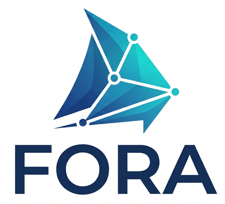

# Fora

Federation Orchestration and Runtime Architecture

A .NET product family for building, running and operating **IEEE 1516-2025 (HLA 4)** federations: a federate SDK, a
full-capability RTI server, and host tools to operate it — all speaking the standard HLA 4 Federate Protocol.

[Get started](#getting-started){ .md-button .md-button--primary }
[Read the manuals](manuals/index.md){ .md-button }
[NuGet packages](https://www.nuget.org/packages?q=Fora.Rti+Fora.Client){ .md-button }

IEEE 1516-2025 / HLA 4.NET 10Federate ProtocolApache-2.0

## Highlights

-   :material-layers-triple-outline:{ .lg .middle } **Built for HLA 4**

    ---

    Every HLA service group — federation, declaration, object, ownership, time and data distribution management,
    synchronization points, save/restore and MOM — over the IEEE 1516-2025 Federate Protocol.

-   :material-check-decagram:{ .lg .middle } **Verified with independent software**

    ---

    Pitch's open-source FedProClient, in Java and C++, runs unmodified against the Fora RTI over TCP, TLS,
    WebSocket and secure WebSocket. 19 findings were traced to the standard and fixed.

-   :material-server-network:{ .lg .middle } **Many federations, one server**

    ---

    Each federation keeps its own FOM modules, time management and saves; nothing crosses between them.

-   :material-connection:{ .lg .middle } **Resilient sessions**

    ---

    Federates survive dropped connections: the session resumes and missed messages are replayed.

-   :material-cloud-check-outline:{ .lg .middle } **Ready to host**

    ---

    Headless server, Docker-ready, health and admin endpoints, TLS and HLA authorization.

-   :material-chart-timeline-variant:{ .lg .middle } **Research-friendly**

    ---

    Built-in telemetry for measuring encoding, routing and delivery costs across federates and the RTI.

## User Manuals

-   :material-code-braces:{ .lg .middle } **Fora.Client Programmer's Manual**

    ---

    Build .NET federates: connect, join, callbacks, publish/subscribe, updates, interactions, DDM, time and
    shutdown.

    [:octicons-arrow-right-24: Read the manual](manuals/fora-client-programmers-manual.md)

-   :material-monitor-dashboard:{ .lg .middle } **Fora.Rti.Console User Manual**

    ---

    Run the RTI with a live terminal dashboard, or attach to a running server.

    [:octicons-arrow-right-24: Read the manual](manuals/console-user-manual.md)

-   :material-console:{ .lg .middle } **Fora.Rti.Admin User Manual**

    ---

    Health checks, logs, snapshots and JSON output for scripts, CI and remote management.

    [:octicons-arrow-right-24: Read the manual](manuals/admin-tool-user-manual.md)

-   :material-tools:{ .lg .middle } **Fora.Rti.Admin.Client Programmer's Manual**

    ---

    Build your own RTI dashboards, monitors and automation on the admin API.

    [:octicons-arrow-right-24: Read the manual](manuals/admin-client-programmers-manual.md)

## Packages

### Server

-   :material-server:{ .lg .middle } **Fora.Rti**

    ---

    Full-capability RTI implementing IEEE 1516-2025 (HLA 4), used by HLA federation development environments such
    as [SimGe](https://sites.google.com/view/okantopcu/simge). Headless server with Federate Protocol listeners,
    health and admin endpoints.

    [:octicons-arrow-right-24: NuGet](https://www.nuget.org/packages/Fora.Rti)

### Hosts

-   :material-monitor-dashboard:{ .lg .middle } **Fora.Rti.Console** · `fora-console`

    ---

    Interactive terminal dashboard. Runs the RTI in-process for local development, or attaches to a running server
    for live logs, federations, federates and sessions.

    [:octicons-arrow-right-24: NuGet](https://www.nuget.org/packages/Fora.Rti.Console)

-   :material-console:{ .lg .middle } **Fora.Rti.Admin** · `fora-admin`

    ---

    Automation-ready command line for remote administration, CI/CD health checks, snapshots and JSON status
    reports.

    [:octicons-arrow-right-24: NuGet](https://www.nuget.org/packages/Fora.Rti.Admin)

### SDKs

-   :material-code-braces:{ .lg .middle } **Fora.Client**

    ---

    The .NET SDK for HLA 4 federates: asynchronous API, callback dispatch and automatic session resume over TCP,
    TLS and WebSocket.

    [:octicons-arrow-right-24: NuGet](https://www.nuget.org/packages/Fora.Client)

-   :material-tools:{ .lg .middle } **Fora.Rti.Admin.Client**

    ---

    SDK for custom RTI management tools, dashboards and simulation control utilities.

    [:octicons-arrow-right-24: NuGet](https://www.nuget.org/packages/Fora.Rti.Admin.Client)

-   :material-chart-timeline-variant:{ .lg .middle } **Fora.Telemetry**

    ---

    Telemetry for performance research: event records, run manifests, `.fort` readers and projection helpers.

    [:octicons-arrow-right-24: NuGet](https://www.nuget.org/packages/Fora.Telemetry)

## Getting Started

Install the packages that match your role in the HLA workflow:

<pre><code class="language-powershell"># Build a federate
dotnet add package Fora.Client --version 20260720.0.0

# Run the RTI with a live dashboard
dotnet tool install -g Fora.Rti.Console --version 20260720.0.0

# Administer a running RTI
dotnet tool install -g Fora.Rti.Admin --version 20260720.0.0

# Host the RTI server
dotnet add package Fora.Rti --version 20260720.0.0
</code></pre>

Then connect a federate to the RTI (`fora-console` starts one on `localhost:15164`):

<pre><code class="language-csharp">await using var client = new ForaClient();
var ambassador = new MyFederateAmbassador();

await client.ConnectAsync("localhost:15164", ambassador);
await client.CreateFederationExecutionAsync("DemoFederation", "MyFom.xml");
await client.JoinFederationExecutionAsync("FederateA", "Example", "DemoFederation");
</code></pre>

The [Fora.Client Programmer's Manual](manuals/fora-client-programmers-manual.md) takes it from there.

## Solution Architecture

Fora is organized in four tiers; each builds only on the ones below it.

| Tier | Components |
| :--- | :--- |
| **Hosts** — run or operate an RTI | `Fora.Rti.Console` (`fora-console`), `Fora.Rti.Admin` (`fora-admin`) |
| **Server** — the RTI | `Fora.Rti.Server` (package `Fora.Rti`): Federate Protocol listeners, sessions, request dispatch, callbacks, health and admin endpoints · `Fora.Rti.Core`: the HLA state machine |
| **SDKs** — libraries for your applications | `Fora.Client` for federates, `Fora.Rti.Admin.Client` for management tools |
| **Foundation** — shared building blocks | `Fora.Abstractions` (HLA API contracts), `Fora.Core` (Federate Protocol sessions, FOM loading), `Fora.Encoding` (IEEE 1516.2-2025 data encoding), `Fora.Protocol` (message contracts), `Fora.Rti.Admin.Abstractions`, `Fora.Telemetry` |

## Technical Specifications

| Specification | Details |
| :--- | :--- |
| **Target framework** | .NET 10.0 |
| **Standard** | IEEE 1516-2025 (HLA 4) |
| **Protocol** | IEEE 1516-2025 Federate Protocol, with session resume and heartbeat |
| **Transports** | TCP, TLS, WebSocket, secure WebSocket |
| **Verified interoperability** | Pitch FedProClient (Java and C++), on all four transports |
| **Console UI** | Terminal.Gui, Spectre.Console |
| **Serialization** | Protocol Buffers |
| **Key dependencies** | `Google.Protobuf`, `Microsoft.Extensions.Logging.Abstractions` |

## License & Credits

**Author:** Okan Topcu · **License:** Apache-2.0 · **Copyright** © 2026

!!! note "Disclaimer"

    Fora is a free academic research toolbox provided "as is", without warranty or guaranteed support. It is intended
    solely for research and educational use and is not suitable for production or mission-critical environments.
    Backward compatibility is not guaranteed. Users assume all risks associated with its use. Feedback is welcome via
    the [Contact page](https://sites.google.com/view/okantopcu/contact).
