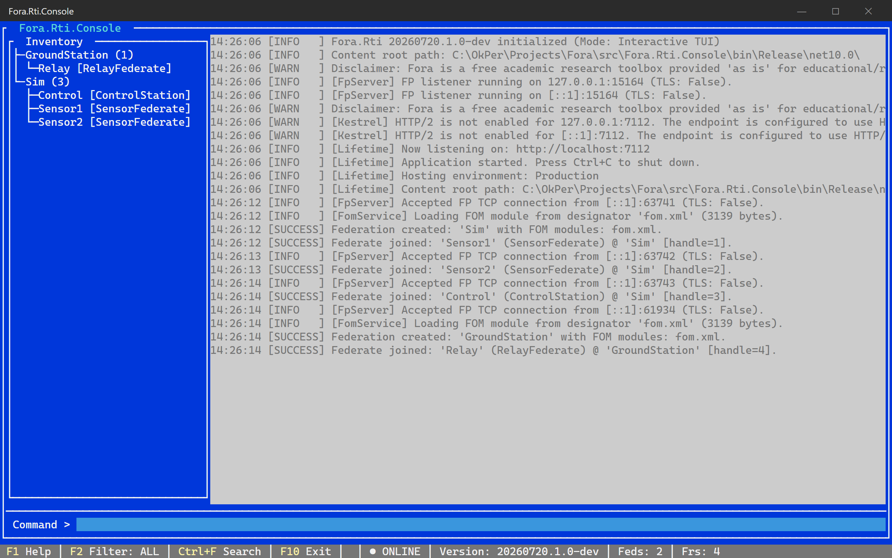

# Fora.Rti.Console User Manual

`Fora.Rti.Console` is the interactive Terminal User Interface (TUI) for `Fora.Rti`. It provides a live dashboard for local development and remote server diagnostics — either by starting the RTI in-process or by connecting to an already-running `Fora.Rti.Server` instance.

## Table of Contents
- [When to Use Console](#when-to-use-console)
- [Starting Console](#starting-console)
  - [In-Process Mode](#in-process-mode)
  - [Remote Mode](#remote-mode)
- [TUI Layout](#tui-layout)
  - [Inventory TreeView](#inventory-treeview)
- [Commands](#commands)
- [Usage Examples](#usage-examples)
- [Runtime Notes](#runtime-notes)
- [Disclaimer](#disclaimer)

---

## When to Use Console

| Scenario | Recommended tool |
| :--- | :--- |
| Local development with a live dashboard | `Fora.Rti.Console` (in-process mode) |
| Attaching a UI to a running Docker/cloud RTI | `fora-console --connect <url>` (remote mode) |
| Headless server (CI, Docker, background service) | `Fora.Rti.Server` |
| One-off remote commands from a script | `fora-admin` — see the [Fora.Rti.Admin User Manual](admin-tool-user-manual.md) |

---

## Starting Console

### In-Process Mode

Starts the RTI server and the TUI in a single process. Federates connect to the same Federate Protocol endpoint that the embedded server listens on.

<pre><code class="language-powershell">dotnet run --project src\Fora.Rti.Console\Fora.Rti.Console.csproj
</code></pre>

Or, installed as a .NET tool (`dotnet tool install -g Fora.Rti.Console`):

<pre><code class="language-bash">fora-console
</code></pre>

The content root is resolved to the directory containing the running executable (`AppContext.BaseDirectory`), which contains the copied `Standards/` directory and configuration files. In development mode, if the `Standards` folder is missing from the base directory, it falls back to checking the repository's `src/Fora.Rti.Server/` folder.

#### MIM and Content Root Validation
At startup in Local Mode, the in-process server logs its active content root path and verifies the presence of the HLA standard MIM file (`Standards/HLAstandardMIM-2025.xml`). If the file is missing, a critical error is logged in the console:
`[ERROR] Standard MIM file not found at '...'. In-process federates will fail to join/create federations.`
If this error appears, ensure that the `Standards` directory has been correctly copied alongside the binary or is accessible in the resolved path.

The server configuration (FP port, bind address, save path) is read from `appsettings.json` in the Console output directory. Defaults:

| Setting | Default |
| :--- | :--- |
| `FederateProtocolPort` | `15164` |
| `FederateProtocolBindAddress` | `localhost` |
| `SavePath` | `saves` |

### Remote Mode

Attaches Console as a management UI to an already-running `Fora.Rti.Server` instance. No in-process RTI is started.

<pre><code class="language-powershell">dotnet run --project src\Fora.Rti.Console\Fora.Rti.Console.csproj -- --connect http://localhost:8080
</code></pre>

Or against a remote host:

<pre><code class="language-bash">fora-console --connect http://my-rti-host:8080
</code></pre>

Against an HTTPS server whose admin API requires a key:

<pre><code class="language-bash">fora-console --connect https://my-rti-host:8443 --token "$ADMIN_KEY" --timeout 30
</code></pre>

To keep the key out of the process argument list, set `FORA_RTI_TOKEN` instead. An explicit `--token` value takes precedence over the environment variable.

#### CLI Options & Help Validation

You can request usage information using any of the standard help flags:

<pre><code class="language-bash">fora-console --help
fora-console -h
fora-console -?
</code></pre>

| Option | Description |
| :--- | :--- |
| `--connect <url>` | Selects remote mode. The value must be an absolute `http` or `https` URL. |
| `--token <key>` | Sends the admin API key as an `Authorization: Bearer <key>` header. Falls back to `FORA_RTI_TOKEN`. |
| `--timeout <seconds>` | Sets the remote HTTP timeout to a positive whole number of seconds. Default: `10`. |
| `-h`, `--help`, `-?`, `/?` | Prints usage and exits. |

CLI arguments are validated at startup:
- If a help flag is requested, the Console prints a complete usage manual and exits successfully.
- Missing values, duplicate remote options, unsupported URL schemes, relative URLs, and invalid timeout values print a specific error plus usage and exit with code `1`.
- `--token` and `--timeout` are valid only with `--connect`.
- Unknown configuration overrides are passed down to configure the generic host.

In remote mode:
- All commands execute against the remote server via `/admin/*` and `/version` HTTP endpoints.
- The TUI status bar (federation count, federate count, version) refreshes every second.
- The log panel seeds from `GET /admin/logs` and then tails `GET /admin/logs/stream`. If the stream fails or closes unexpectedly, Console catches up from the last received timestamp and reconnects automatically with cancellable exponential delays of 1, 2, 4, 8, 16, and at most 30 seconds. Older entries and exact duplicates at the cursor timestamp are discarded, while distinct entries sharing that timestamp are retained. Repeated diagnostics are limited to three error lines per continuous outage.
- `exit` / `quit` closes Console only — the remote server keeps running.

---

## TUI Layout

### Inventory TreeView

The left-side **Inventory** panel is a hierarchical `TreeView` of the current RTI inventory:

- Federation execution roots show the federation name and joined federate count.
- Child nodes show each federate name and type. Federation and federate names are sorted consistently.
- Newly observed federation roots start expanded. Use the TreeView arrow keys to select nodes and expand or collapse federation roots.
- Selection and expansion state are retained across refreshes while the corresponding item still exists. The tree is rebuilt only when its structural content changes.
- When no federation execution is active, the panel displays `No active federations`.
- The panel refreshes from the same `IRtiAdminClient` federation and federate queries as the status bar. It is visible at terminal widths of 100 columns or more, uses 24–32 columns, and hides automatically below 100 columns.

**System logs** — a dedicated `TextView` area for RTI logs and command output. It uses the space beside the inventory on wide terminals and automatically regains the full width when the inventory is hidden:
- **Auto-scroll:** New entries automatically scroll the view to the bottom.
- **Selection:** Supports text selection using Mouse or `Shift + Arrow Keys`.
- **Copy:** Supports standard `Ctrl + C` for copying selected logs.
- **Navigation:** Supports PageUp/PageDown and Scrollbar navigation.
- **Filtering:** Press `F2` to cycle through log levels (ALL, INFO, SUCCESS, WARN, ERROR).
- **Searching:** Press `Ctrl+F` to toggle **Inline Search**. Type to filter logs in real-time. Press `Esc` or `Ctrl+F` again to clear the search and return to command mode. Both active filters are displayed in the status bar.

**Command input** — fixed bottom area separated by a responsive `LineView` that follows the terminal width:
- **Prompt:** A distinct `Command >` prompt with a high-contrast input field.
- **Command History:** Use **Up/Down Arrow Keys** to navigate through previously entered commands.
- **Execution:** Press **Enter** to execute.

**Status bar** — bottom bar, refreshed every second:
- Interactive shortcuts (`F1 Help`, `F2 Filter`, `Ctrl+F Search`, `F10 Exit`).
- Active search pattern (if any).
- **Connection Status Indicator:** Displays the connection state:
  - `● ONLINE` when communication with the RTI server is active and healthy.
  - `● CONNECTING` during initial startup.
  - `● RECONNECTING` while the remote SSE log stream is waiting for another connection attempt. Periodic successful status queries do not hide this state.
  - `● OFFLINE (<error>)` when communication fails. Long error descriptions are automatically formatted and truncated to a maximum of 30 characters to avoid status bar overflow, while the full diagnostic error is logged to the log view.
- Server version.
- Active federation execution count.
- Joined federate count.

---

## Commands

| Command | Alias | Description |
| :--- | :--- | :--- |
| `version` | | Displays server-side version information (Component, Standard, HLA, CapabilityLevel). |
| `health` | | Queries the RTI health check and prints `Healthy` or `Unhealthy`. |
| `lsfed` | `listfederations` | Lists all active federation executions. |
| `lsfr` | `listjoinedfederates` | Lists all joined federates with their type and federation name. |
| `sessions` | | Lists all active Federate Protocol sessions. |
| `save <label>` | | Saves a full RTI state snapshot with the given label. |
| `restore <label>` | | Restores RTI state from a previously saved snapshot. |
| `shutdown` | | Initiates a graceful server shutdown. |
| `help` | `?` | Prints available commands into the log area. |
| `exit` | `quit` | Exits Console and gracefully shuts down the in-process RTI server (in local mode). |

---

## Usage Examples

### Check server health

<pre><code class="language-text">&gt; health
Healthy
</code></pre>

### List active federations

<pre><code class="language-text">&gt; lsfed
Sim
GroundStation
</code></pre>

### List joined federates

<pre><code class="language-text">&gt; lsfr
Sensor1    HLA_EVOLVED    Sim
Control    HLA_EVOLVED    Sim
Relay      HLA_EVOLVED    GroundStation
</code></pre>

### Save a snapshot before a test run

<pre><code class="language-text">&gt; save pre-test
Saved snapshot 'pre-test'.
</code></pre>

### Restore from a snapshot

<pre><code class="language-text">&gt; restore pre-test
Restored snapshot 'pre-test'.
</code></pre>

### Graceful shutdown

<pre><code class="language-text">&gt; shutdown
Shutdown requested.
</code></pre>

### Monitoring live connections

As federates connect and disconnect, log entries appear automatically:

<pre><code class="language-text">10:05:01 [INFO] Accepted FP TCP connection from 127.0.0.1:49672.
10:05:02 [INFO] Federate 'Sensor1' joined federation 'Sim'.
10:05:45 [INFO] Federate 'Sensor1' resigned from federation 'Sim'.
</code></pre>

---

## Runtime Notes

- **Terminal.Gui (gui.cs)** — Uses a professional TUI library that provides true windowing, event-driven input, and robust cross-platform terminal handling (avoiding standard ANSI redraw issues).
- **Thread isolation** — UI rendering and input handling run on a dedicated main loop thread, isolated from the RTI message loop.
- **Async logging** — Log entries are queued and rendered via `Application.MainLoop.Invoke` without blocking the FP network or simulation engine.
- **Unified Command System** — Both Console and `fora-admin` share the same `IAdminCommand` implementations from `Fora.Rti.Admin.Abstractions`.
- **`IRtiAdminClient` abstraction** — Both in-process (`InProcessAdminClient`) and remote (`HttpAdminClient`) modes implement the same interface.

---

## Disclaimer

See the [Disclaimer](../disclaimer.md) for usage terms and research-only conditions.

